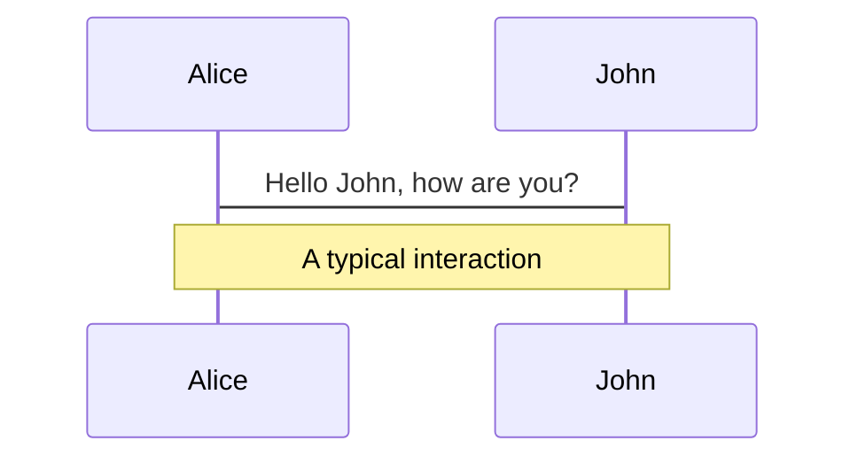
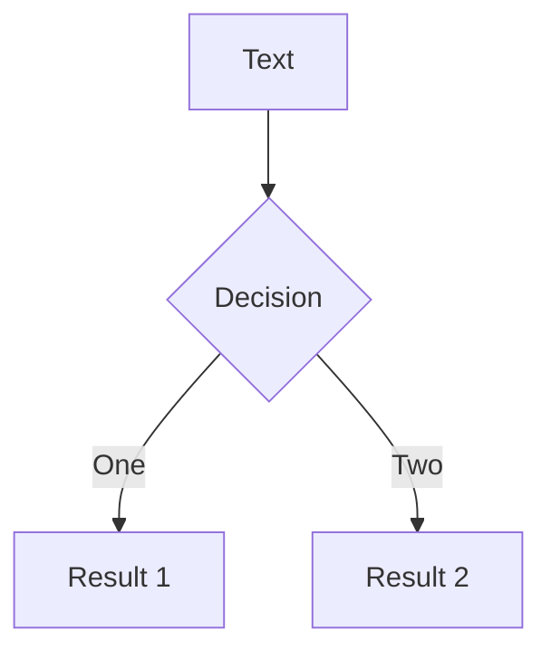
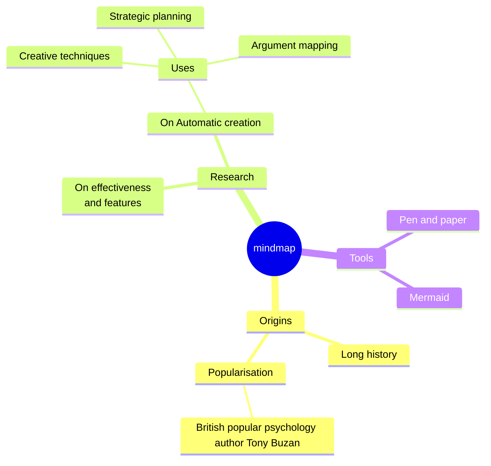
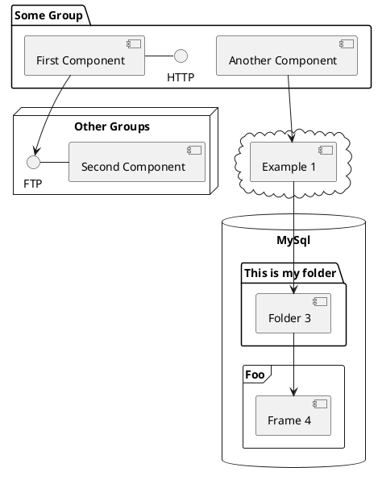

---
# You can also start simply with 'default'
theme: seriph
# random image from a curated Unsplash collection by Anthony
# like them? see https://unsplash.com/collections/94734566/slidev
# background: https://cover.sli.dev
layout: cover
# some information about your slides (markdown enabled)
title: 语义化版本知识分享
info: |
  semantic versioning
# apply unocss classes to the current slide
class: text-center
css: unocss
highlighter: shiki
colorSchema: dark
glowSize: 1.5
# https://sli.dev/features/drawing
drawings:
  persist: true
# slide transition: https://sli.dev/guide/animations.html#slide-transitions
transition: fade-out
# enable MDC Syntax: https://sli.dev/features/mdc
mdc: true

# open graph
# seoMeta:
#  ogImage: https://cover.sli.dev
---

# 语义化版本(semver)知识分享

zhangshilong12
<div uppercase text-sm tracking-widest>
Long Mo
</div>

<div abs-br mx-13 my-12 flex="~ col" text-sm text-left>
  <div>web 前端</div>
  <div text-sm opacity-50>20250412</div>
</div>

<!--
The last comment block of each slide will be treated as slide notes. It will be visible and editable in Presenter Mode along with the slide. [Read more in the docs](https://sli.dev/guide/syntax.html#notes)
-->

---
layout: intro
mdc: true
---

### 但是！{.op50.mb-2.ml5}

## 「特例化」也不是坏事 {v-click}

<v-click>

#### [扩大]{.op50}[「交集」]{.text-purple} []{.inline-block.i-gis-intersection.translate-y-1/10.text-purple}

</v-click>

<v-click>

#### [寻找]{.op50} [「并集」]{.text-lime} []{.inline-block.i-gis-union.translate-y-1/10.text-lime}

</v-click>

---
mdc: true
---

这是一个 [红色的文本]{style="color:red"} :inline-component{prop="value"}


::block-component{prop="value"}
**default** 插槽的内容
::

---
transition: fade-out

layout: center
glowX: 50
glowY: 0
---

# 什么是语义化版本(semver)?

<v-clicks>

- 全称：semantic versioning
- **语义化版本** 不仅仅局限于前端开发，而是一个广泛应用于软件管理领域的一个概念
- 一种为了确保软件版本号能够清晰、准确地传达软件变更信息而制定的版本**编号规则**。

</v-clicks>

<!--
这套版本编号系统不仅适用于各种编程语言编写的应用程序，也同样适用于库、框架等软件包的版本控制。

无论是前端JavaScript库、后端服务、移动应用还是桌面软件，任何类型的软件项目都可以采用语义化版本来规范其发布周期和版本号的递增逻辑，

从而促进项目的可持续维护以及与其他软件系统的兼容性和依赖性管理。
-->

---
layout: quote
class: text-center
---

# 为什么要使用语义化版本?

---
transition: slide-up
level: 2
---

# 作用


语义化版本是为了解决版本管理中存在的一些问题，

比如版本号递增，版本号冲突，版本号不兼容等,

从而提高软件项目的可维护性、依赖管理和用户信任度

<!--
清晰传达变更的性质：通过主版本号、次版本号和修订号的变化，可以明确地向用户传达本次更新是包含重大更改（可能需要用户调整自己的代码）、新增功能还是仅仅修复了一些bug。这有助于用户快速了解升级可能带来的影响。

简化依赖管理：在复杂的软件生态系统中，一个项目往往依赖于多个库或包。语义化版本允许开发者指定兼容版本范围，例如^1.2.3表示接受任何不改变主版本号的更新。这有助于自动化工具选择合适的依赖版本，减少因依赖问题导致的冲突或错误。

提升用户信任度：遵循统一的版本编号规则可以帮助用户建立对项目的信任。当用户知道项目严格遵守语义化版本控制时，他们能更有信心地进行升级操作，因为他们可以根据版本号预判升级的风险和工作量。

促进协作：在一个团队或者开源社区内，使用语义化版本可以帮助所有参与者更好地理解项目的进展和变化。它提供了一种标准化的语言来描述软件的发展状态，有助于沟通和协调工作。

支持自动化流程：许多CI/CD（持续集成/持续部署）流水线和依赖管理系统都支持基于语义化版本的工作流。这意味着可以更容易实现自动化测试、构建和发布过程，进一步加速开发周期。

增强生态系统的稳定性：在整个软件生态系统中广泛采用语义化版本有助于保持整个生态系统的稳定性和健康性。它减少了由于不兼容更新导致的问题，促进了不同软件之间的互操作性和长期维护。
-->

---
layout: two-cols
layoutClass: gap-16
---

# Table of contents

You can use the `Toc` component to generate a table of contents for your slides:

```html

<Toc minDepth="1" maxDepth="1"/>
```
{Vite} {Vue} {Nuxt} 核心团队成员<br>
The title will be inferred from your slide content, or you can override it with `title` and `level` in your frontmatter.

::right::

<Toc text-sm minDepth="1" maxDepth="2" />

---
layout: image-right
image: https://cover.sli.dev
---

# Code

Use code snippets and get the highlighting directly, and even types hover!

```ts {all|5|7|7-8|10|all} twoslash
// TwoSlash enables TypeScript hover information
// and errors in markdown code blocks
// More at https://shiki.style/packages/twoslash

import {computed, ref} from 'vue'

const count = ref(0)
const doubled = computed(() => count.value * 2)

doubled.value = 2
```

<arrow v-click="[4, 5]" x1="350" y1="310" x2="195" y2="334" color="#953" width="2" arrowSize="1" />

<!-- This allow you to embed external code blocks -->
<<< @/snippets/external.ts#snippet

<!-- Footer -->

[Learn more](https://sli.dev/features/line-highlighting)

<!-- Inline style -->
<style>
.footnotes-sep {
  @apply mt-5 opacity-10;
}
.footnotes {
  @apply text-sm opacity-75;
}
.footnote-backref {
  display: none;
}
</style>

<!--
Notes can also sync with clicks

[click] This will be highlighted after the first click

[click] Highlighted with `count = ref(0)`

[click:3] Last click (skip two clicks)
-->

---
level: 2
---

# Shiki Magic Move

Powered by [shiki-magic-move](https://shiki-magic-move.netlify.app/), Slidev supports animations across multiple code
snippets.

Add multiple code blocks and wrap them with <code>````md magic-move</code> (four backticks) to enable the magic move.
For example:

````md magic-move {lines: true}
```ts {*|2|*}
// step 1
const author = reactive({
  name: 'John Doe',
  books: [
    'Vue 2 - Advanced Guide',
    'Vue 3 - Basic Guide',
    'Vue 4 - The Mystery'
  ]
})
```

```ts {*|1-2|3-4|3-4,8}
// step 2
export default {
  data() {
    return {
      author: {
        name: 'John Doe',
        books: [
          'Vue 2 - Advanced Guide',
          'Vue 3 - Basic Guide',
          'Vue 4 - The Mystery'
        ]
      }
    }
  }
}
```

```ts
// step 3
export default {
  data: () => ({
    author: {
      name: 'John Doe',
      books: [
        'Vue 2 - Advanced Guide',
        'Vue 3 - Basic Guide',
        'Vue 4 - The Mystery'
      ]
    }
  })
}
```

Non-code blocks are ignored.

```vue
<!-- step 4 -->
<script setup>
const author = {
  name: 'John Doe',
  books: [
    'Vue 2 - Advanced Guide',
    'Vue 3 - Basic Guide',
    'Vue 4 - The Mystery'
  ]
}
</script>
```
````

---

# Components

<div grid="~ cols-2 gap-4">
<div>

You can use Vue components directly inside your slides.

We have provided a few built-in components like `<Tweet/>` and `<Youtube/>` that you can use directly. And adding your
custom components is also super easy.

```html

<Counter :count="10"/>
```

<!-- ./components/Counter.vue -->
<Counter :count="10" m="t-4" />

Check out [the guides](https://sli.dev/builtin/components.html) for more.

</div>
<div>

```html

<Tweet id="1390115482657726468"/>
```

<Tweet id="1390115482657726468" scale="0.65" />

</div>
</div>

<!--
Presenter note with **bold**, *italic*, and ~~striked~~ text.

Also, HTML elements are valid:
<div class="flex w-full">
  <span style="flex-grow: 1;">Left content</span>
  <span>Right content</span>
</div>
-->

---
class: px-20
---

# Themes

Slidev comes with powerful theming support. Themes can provide styles, layouts, components, or even configurations for
tools. Switching between themes by just **one edit** in your frontmatter:

<div grid="~ cols-2 gap-2" m="t-2">

```yaml
---
theme: default
---
```

```yaml
---
theme: seriph
---
```


</div>

Read more about [How to use a theme](https://sli.dev/guide/theme-addon#use-theme) and
check out the [Awesome Themes Gallery](https://sli.dev/resources/theme-gallery).

---

# Clicks Animations

You can add `v-click` to elements to add a click animation.

<div v-click>

This shows up when you click the slide:

```html

<div v-click>This shows up when you click the slide.</div>
```

</div>

<br>

<v-click>

The <span v-mark.red="3"><code>v-mark</code> directive</span>
also allows you to add
<span v-mark.circle.orange="4">inline marks</span>
, powered by [Rough Notation](https://roughnotation.com/):

```html
<span v-mark.underline.orange>inline markers</span>
```

</v-click>

<div mt-20 v-click>

[Learn more](https://sli.dev/guide/animations#click-animation)

</div>

---

# Motions

Motion animations are powered by [@vueuse/motion](https://motion.vueuse.org/), triggered by `v-motion` directive.

```html

<div
		v-motion
		:initial="{ x: -80 }"
		:enter="{ x: 0 }"
		:click-3="{ x: 80 }"
		:leave="{ x: 1000 }"
>
	Slidev
</div>
```

<div class="w-60 relative">
  <div class="relative w-40 h-40">
    
    
    
  </div>

  <div
    class="text-5xl absolute top-14 left-40 text-[#2B90B6] -z-1"
    v-motion
    :initial="{ x: -80, opacity: 0}"
    :enter="{ x: 0, opacity: 1, transition: { delay: 2000, duration: 1000 } }">
    Slidev
  </div>
</div>

<!-- vue script setup scripts can be directly used in markdown, and will only affects current page -->
<script setup lang="ts">
const final = {
  x: 0,
  y: 0,
  rotate: 0,
  scale: 1,
  transition: {
    type: 'spring',
    damping: 10,
    stiffness: 20,
    mass: 2
  }
}
</script>

<div
  v-motion
  :initial="{ x:35, y: 30, opacity: 0}"
  :enter="{ y: 0, opacity: 1, transition: { delay: 3500 } }">

[Learn more](https://sli.dev/guide/animations.html#motion)

</div>

---

# LaTeX

LaTeX is supported out-of-box. Powered by [KaTeX](https://katex.org/).

<div h-3 />

Inline $\sqrt{3x-1}+(1+x)^2$

Block
$$ {1|3|all}
\begin{aligned}
\nabla \cdot \vec{E} &= \frac{\rho}{\varepsilon_0} \\
\nabla \cdot \vec{B} &= 0 \\
\nabla \times \vec{E} &= -\frac{\partial\vec{B}}{\partial t} \\
\nabla \times \vec{B} &= \mu_0\vec{J} + \mu_0\varepsilon_0\frac{\partial\vec{E}}{\partial t}
\end{aligned}
$$

[Learn more](https://sli.dev/features/latex)

---

# Diagrams

You can create diagrams / graphs from textual descriptions, directly in your Markdown.

<div class="grid grid-cols-4 gap-5 pt-4 -mb-6">









</div>

Learn more: [Mermaid Diagrams](https://sli.dev/features/mermaid)
and [PlantUML Diagrams](https://sli.dev/features/plantuml)

---
foo: bar
dragPos:
square: 691,32,167,_,-16
square: 691,32,167,_,-16
---

# Draggable Elements

Double-click on the draggable elements to edit their positions.

<br>

###### Directive Usage

```md

```

<br>

###### Component Usage

```md
<v-drag text-3xl>
  <div class="i-carbon:arrow-up" />
  Use the `v-drag` component to have a draggable container!
</v-drag>
```

<v-drag pos="663,206,261,_,-15">
  <div text-center text-3xl border border-main rounded>
    Double-click me!
  </div>
</v-drag>


###### Draggable Arrow

```md
<v-drag-arrow two-way />
```

<v-drag-arrow pos="67,452,253,46" two-way op70 />

---
src: ./pages/imported-slides.md
hide: false
---

---

# Monaco Editor

Slidev provides built-in Monaco Editor support.

Add `{monaco}` to the code block to turn it into an editor:

```ts {monaco}
import {ref} from 'vue'
import {emptyArray} from './external'

const arr = ref(emptyArray(10))
```

Use `{monaco-run}` to create an editor that can execute the code directly in the slide:

```ts {monaco-run}
import {version} from 'vue'
import {emptyArray, sayHello} from './external'

sayHello()
console.log(`vue ${version}`)
console.log(emptyArray<number>(10).reduce(fib => [...fib, fib.at(-1)! + fib.at(-2)!], [1, 1]))
```

---
layout: center
class: text-center
---

# Learn More

[Documentation](https://sli.dev) · [GitHub](https://github.com/slidevjs/slidev) · [Showcases](https://sli.dev/resources/showcases)

<PoweredBySlidev mt-10 />
